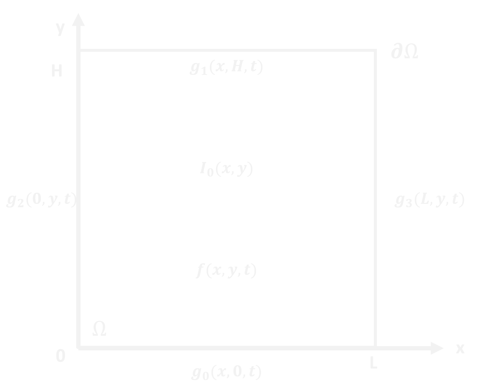

# Diffusion2D_Library

Solves the diffusion equation in 1 or 2 dimensions.

"Diffusion2D_Library" is a C# library for solving parabolic partial differential equations in 1 or 2 dimensions.  A representative region, &Omega;, in the cartesian plane, with boundary conditions specified on &delta;&Omega; and initial condition indicated, is shown to the right.  

The classic examples for parabolic partial differential equations are the heat and the diffusion equations.  The forms for both equations are shown in Eq 1 and the solutions are subject to an initial and boundary conditions.  The differences lie in the physical interpretation of the terms that make up the &nu; parameter and the types of boundary conditions imposed.  We will focus on solutions to the diffusion equation in this write-up.

***

|1| &delta;c/&delta;t - D(&delta;2c/&delta;x2) - f(x,t) = 0|
|-|--------------------------------------------------------------------------------|

where  x is a 1 or 2-dimensional vector and D represents the diffusivity of the diffusing species.

Subject to an initial condition:

|2| c(x,0) = I0(x)|
|-|--------------------------|

and boundary conditions:

in 1 dimension:

|3| c(0,t) = g0(t)|
|-|--------------------------|

|4| c(L,t) = g1(t)| 
|-|--------------------------|

 or 2 dimensions:

|5| c(0,y,t) = g0(t)|
|-|----------------------------|

|6| c(L,y,t) = g1(t)|
|-|----------------------------|

|7| c(x,0,t) = g2(t)|
|-|----------------------------|

|8| c(x,H,t) = g3(t)|
|-|----------------------------|
 
***
## Numerical Solvers
 The region, &Omega;, is discretized in space such that &Delta;x = &Delta;y and there are Nx grid points in the x-direction and Ny grid points in the y-direction.  Time is discretized into time-steps of &Delta;t duration.  Diffusion is calculated for Nt time-steps.  The Fourier mesh number, &nu;, for the discretized space and time is given by equation 9.
 

|9| &nu; = D&Delta;t/&Delta;x2|
|-|--------------------------------------|
