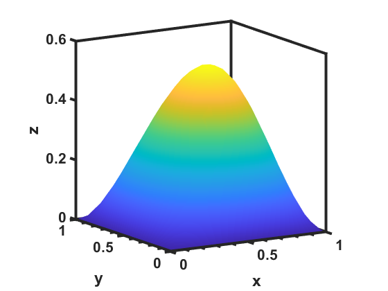

# Diffusion2D_Library

Solves the diffusion equation in 1 or 2 dimensions.

***

"Diffusion2D_Library" is a C# library for solving parabolic partial differential equations in 1 or 2 dimensions.  A representative region, &Omega;, in the cartesian plane, with boundary conditions specified on &delta;&Omega; and initial condition indicated, is shown to the right.  

The classic examples for parabolic partial differential equations are the heat and the diffusion equations.  The forms for both equations are shown in Eq 1 and the solutions are subject to an initial and boundary conditions.  The differences lie in the physical interpretation of the terms that make up the &nu; parameter and the types of boundary conditions imposed.  We will focus on solutions to the diffusion equation in this write-up.

***

|1| &delta;c/&delta;t - D(&delta;2c/&delta;x2) - f(x,t) = 0|
|-|--------------------------------------------------------------------------------|

where  x is a 1 or 2-dimensional vector and D represents the diffusivity of the diffusing species.

Subject to an initial condition:

|2| c(x,0) = I0(x)|
|-|--------------------------|

and boundary conditions:

in 1 dimension:

|3| c(0,t) = g0(t)|
|-|--------------------------|

|4| c(L,t) = g1(t)| 
|-|--------------------------|

 or 2 dimensions:

|5| c(0,y,t) = g0(t)|
|-|----------------------------|

|6| c(L,y,t) = g1(t)|
|-|----------------------------|

|7| c(x,0,t) = g2(t)|
|-|----------------------------|

|8| c(x,H,t) = g3(t)|
|-|----------------------------|
 
***
## Numerical Solvers
 The region, &Omega;, is discretized in space such that &Delta;x = &Delta;y and there are Nx grid points in the x-direction and Ny grid points in the y-direction.  Time is discretized into time-steps of &Delta;t duration.  Diffusion is calculated for Nt time-steps.  The Fourier mesh number, &nu;, for the discretized space and time is given by equation 9.
 

|9| &nu; = D&Delta;t/&Delta;x2|
|-|--------------------------------------|
***
## Installation
The Diffusion2D_Library package can be obtained by using the nuget package manager in Visual Studio or by going to the NuGet [link](https://www.nuget.org/packages/Diffusion2D_Library/ "site") and using the provided commands.
***
## How to use the library
Once the library package has been added to a project, it can be invoked using the following code:
~~~
public void Test_2D_DiffusionSimulation()
        {
            string base_name = "Base_Output_Name"; //the iteration number will be appended to the name

            double L = 100.0e-4;                // cm
            double H = 100.0e-4;                // cm
            int NX = 50;                        // Node number
            int NY = 50;                        // Node number
            double dx = L / NX;                 // cm
            double dy = H / NY;                 // cm
            double dt = 1.0e-4;                 // s
            double Duration = 1.0e3;            // s
            int NT = (int)(Duration / dt) + 1;  // Number of iterations
            int Output = (int)(5.0 / dt);       // delay between writing output files, s
            Mode VMode = Mode.verbose;          // Specifies whether output text is shown on the console
            
            // Order of boundaries: Top, Right, Left, Bottom
            ABoundaryCondition[] BCs = new ABoundaryCondition[4] { ABoundaryCondition.dirichlet, ABoundaryCondition.neumann, ABoundaryCondition.neumann, ABoundaryCondition.neumann }; 
            Del_BC_xy[] All_BCs = new Del_BC_xy[4] { Boundary_2D_Constant, Boundary_2D_Zero, Boundary_2D_Zero, Boundary_2D_Zero };
            
            Del_IC_xy IC2 = InitialCondition_2D_Zero;
            
            Del_Source_MatrixD f = SourceTerm_2D_Zero;

            // Specify the diffusion coefficient at each node
            RMatrix D = new(NX, NY);
            for (int i = 0; i < NX; i++)
            {
                for (int j = 0; j < NY; j++)
                {
                    D[i, j] = 1.0e-8;
                }
            }
            // Create a simulator for 2D Diffusion 
            DiffusionSimulators_2D_MatrixD diffusionSimulator_2D = new(D, dx, dx, NX, NY, dt, NT, BCs, All_BCs, IC2, f, VMode, base_name);

            // Solve the diffusion equation for the given initial and boundary conditions
            diffusionSimulator_2D.Solve(NT, Output);
        }
~~~
The source term function, initial condition function, and boundary condition functions are specified in the following manner:

### Source Term
~~~
        public static RMatrix SourceTerm_2D_Zero(RMatrix xposition, RMatrix yposition, double time, RMatrix D, RMatrix composition)
        {
            int nrows = xposition.GetnRows;
            int ncols = xposition.GetnCols;

            RMatrix C_field = new(nrows, ncols);
            return C_field;
        }
~~~

### Initial Condiiton
~~~
        public static RMatrix InitialCondition_2D_Zero(RMatrix xposition, RMatrix yposition)
        {
            int nrows = xposition.GetnRows;
            int ncols = xposition.GetnCols;
            RMatrix composition_field = new(nrows, ncols);
            return composition_field;
        }
~~~
### Boundary Conditions
1. Example of a constant function
~~~
        public static RVector Boundary_2D_Constant(double t, RVector SideNodes, double XorYPositionValue)
        {
            int n = SideNodes.GetRVectorSize;
            RVector BC = new(n);
            for (int i = 0; i < n; i++)
            {
                BC[i] = 1.0; 
            }
            return BC;
        }
~~~
3. Example of a zero-valued function
~~~
        public static RVector Boundary_2D_Zero(double t, RVector SideNodes, double XorYPositionValue)
        {
            int n = SideNodes.GetRVectorSize;
            RVector BC = new(n);
            for (int i = 0; i < n; i++)
            {
                BC[i] = 0.0; 
            }
            return BC;
        }
~~~
